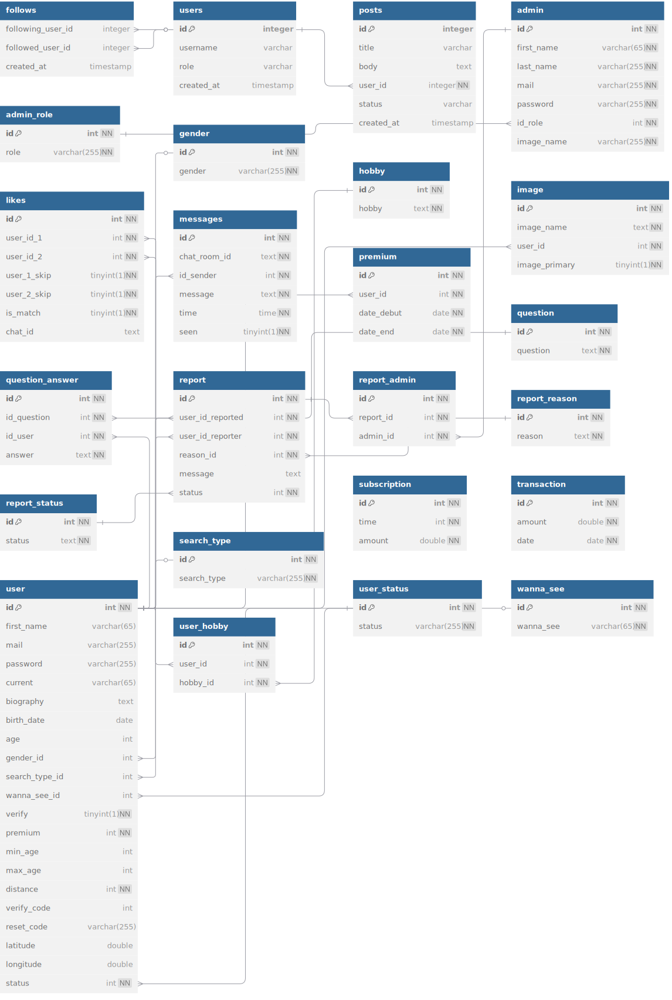

## Description

**Harmony** est une application de rencontre innovante qui connecte les personnes grâce à leur passion commune : la musique. Plutôt que de swiper uniquement sur des photos, Harmony fait matcher ses utilisateurs selon leurs goûts musicaux et leurs playlists, pour créer des connexions authentiques et vibrantes.

---
[Pour tester Harmony](https://harmony-app.duckdns.org/)

---
### Fonctionnalités principales
* 🔍 Algorythme de matching sur les critères (Age, distance, genre recherché)
*  👤 Création et gestion de profils avec photos et préférences
* 📨 Messagerie et Notification en direct
* 🚩Signalement et modération
* 💳 Système d’abonnement pour accéder à des fonctionnalités premium

---

## MCD




---

## Language

### 🛠️ Backend (PHP)
* PHP 8
* API RESTful
* Architecture MVC
* Gestion de sessions via JWT
* Base de données MySQL
* PHPMailer
* Pusher Channels
* Pusher Beams


### 💻 Frontend (React)

* **React 18+** 
* **Tailwind CSS**
* **React Icons**
* **React Router** 
* **Pusher Channels** 
* **Pusher Beams** 
* **Intégration PayPal** 

---

# 🚀 Installation

#### 1. Cloner le projet
```
git clone https://github.com/ImTheOryo/app-loove.git
cd app-loove
```

#### 2. Installer les modules nodes
```
cd ./interface
npm install
```

#### 3. Changer les valeurs dans les constants.js
````
nano ./src/constants/Constant.js
````

#### 4. Installer les composer
```
cd ./api
composer install
```

#### 5. cloner le .env.dist et mettre vos variables d'environement 
```
cp .env.dist .env
nano .env
```

#### 6. Lancer React
````
npm start
````


---


# 📡 API Endpoints

### 👮 Admin

| Méthode | Endpoint                         | Action                                | Restriction     |
| ------- | -------------------------------- | ------------------------------------- | --------------- |
| GET     | `/users`                         | Liste tous les utilisateurs           | ✅ Administrateur |
| GET     | `/admin/{admin_id}`              | Infos d’un admin                      | ✅ Administrateur |
| GET     | `/dashboard`                     | Dashboard général                     | ✅ Administrateur |
| GET     | `/reports`                       | Liste des signalements                | ✅ Administrateur |
| GET     | `/report/{report_id}`            | Détail d’un report                    | ✅ Administrateur |
| PATCH   | `/report/{report_id}`            | Clôturer un report                    | ✅ Administrateur |
| PATCH   | `/report/{action}/{user_id}`     | Actionner un utilisateur (ban, warn…) | ✅ Administrateur |
| GET     | `/admins/{report_id}`            | Voir les admins liés à un report      | ✅ Administrateur |
| GET     | `/report/chat/{report_id}`       | Chat lié au report                    | ✅ Administrateur |
| POST    | `/report/{report_id}/{admin_id}` | Ajouter un admin à un report          | ✅ Administrateur |
| DELETE  | `/report/{report_id}/{admin_id}` | Retirer un admin du report            | ✅ Administrateur |

---

### 👤 Authentification / Inscription

| Méthode | Endpoint      | Action               | Restriction |
| ------- | ------------- | -------------------- | ----------- |
| POST    | `/login`      | Connexion            | ❌ Aucune    |
| POST    | `/reset`      | Reset mot de passe   | ❌ Aucune    |
| POST    | `/register/*` | Étapes d’inscription | ❌ Aucune    |

---

### 🧭 Découverte

| Méthode | Endpoint                            | Action                 | Restriction    |
| ------- | ----------------------------------- | ---------------------- | -------------- |
| GET     | `/discovery/{user_id}`              | Suggestions de profils | ✅ Utilisateur |
| POST    | `/like/{user_id}/{user_like}`       | Like un utilisateur    | ✅ Utilisateur |
| POST    | `/skip/{user_id}/{user_skip}`       | Skip un utilisateur    | ✅ Utilisateur |
| POST    | `/message/{user_id}/{user_send_to}` | Premier message        | ✅ Utilisateur |

---

### 🎯 Filtres

\| GET / PATCH | `/filter/{user_id}` | Gérer les filtres | ✅ Utilisateur |

---

### ❤️ Likes / Localisation

\| GET | `/likes/{user_id}` | Voir qui vous a liké | ✅ Utilisateur |
\| POST | `/localisation` | Enregistrer la position | ✅ Utilisateur |

---

### 💬 Chat

| Méthode | Endpoint                         | Action                    | Restriction    |
| ------- | -------------------------------- | ------------------------- | -------------- |
| GET     | `/match/{user_id}`               | Récupérer les matchs      | ✅ Utilisateur |
| GET     | `/chatroom/{user1}/{user2}`      | Chatroom entre deux users | ✅ Utilisateur |
| GET     | `/chat/{chat_room_id}`           | Voir le chat              | ✅ Utilisateur |
| PATCH   | `/chat/{chat_room_id}/{user_id}` | Marquer comme lu          | ✅ Utilisateur |
| POST    | `/chat/{chat_room_id}/{user_id}` | Envoyer message           | ✅ Utilisateur |

---

### 🚨 Signalement

| Méthode | Endpoint                        | Action                               | Restriction    |
| ------- | ------------------------------- | ------------------------------------ | -------------- |
| GET     | `/reason`                       | Récupérer les raisons de signalement | ✅ Utilisateur |
| POST    | `/report/{reporter}/{reported}` | Signaler un utilisateur              | ✅ Utilisateur |

---

### 👤 Profil & Préférences

| Méthode | Endpoint                            | Action            | Restriction    |
| ------- | ----------------------------------- | ----------------- | -------------- |
| GET     | `/profile/{user_id}`                | Infos profil      | ✅ Utilisateur |
| GET     | `/profile/extended/{user_id}`       | Profil complet    | ✅ Utilisateur |
| PATCH   | `/biography/{user_id}`              | Modifier bio      | ✅ Utilisateur |
| PATCH   | `/gender/{user_id}/{gender_id}`     | Modifier genre    | ✅ Utilisateur |
| PATCH   | `/relation/{user_id}/{relation_id}` | Modifier relation | ✅ Utilisateur |

---

### 🎵 Musique & Questions

| Méthode | Endpoint               | Action                      | Restriction |
| ------- | ---------------------- | --------------------------- | ----------- |
| GET     | `/musics/{user_id}`    | Musiques de l’utilisateur   | ❌ Aucune    |
| POST    | `/music/{user_id}`     | Ajouter une musique         | ❌ Aucune    |
| GET     | `/music/title/{title}` | Recherche musique par titre | ❌ Aucune    |
| GET     | `/questions`           | Questions proposées         | ❌ Aucune    |

---

### 🖼️ Images

| Méthode | Endpoint                   | Action              | Restriction    |
| ------- | -------------------------- | ------------------- | -------------- |
| GET     | `/images/{user_id}`        | Voir ses images     | ✅ Utilisateur |
| POST    | `/images/upload/{user_id}` | Ajouter une image   | ✅ Utilisateur |
| DELETE  | `/image/delete`            | Supprimer une image | ✅ Utilisateur |

---

### 💳 Abonnement

\| GET / POST | `/subscription` | Voir ou souscrire à un plan | ✅ Utilisateur |

---

## Auteur

ImTheOryo